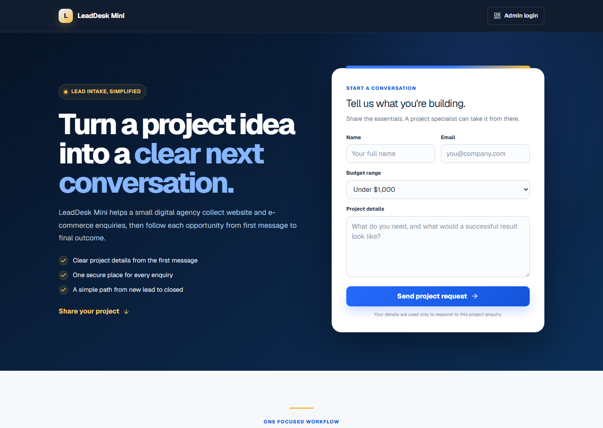
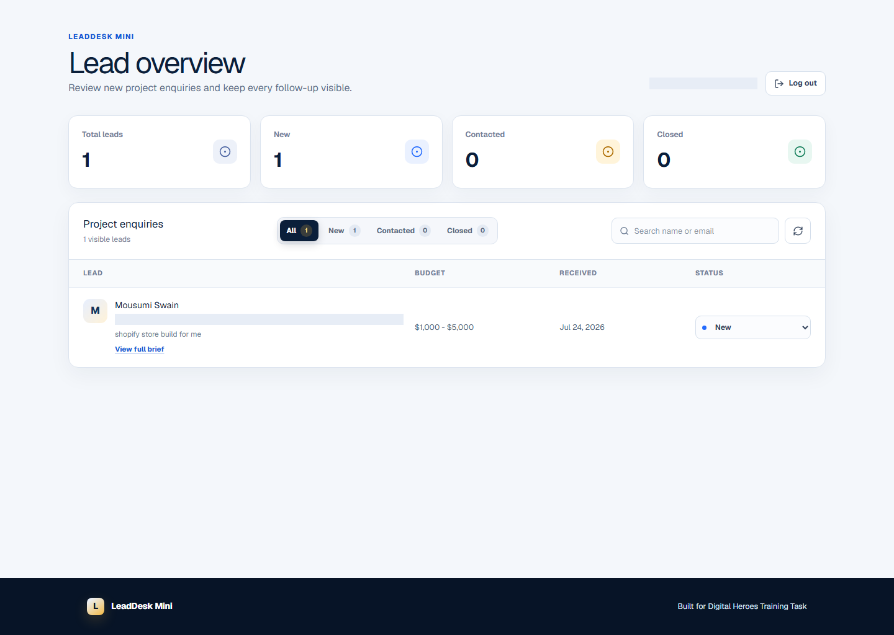

# LeadDesk Mini

LeadDesk Mini is a compact lead-management application for a small digital
agency. A prospective customer can submit a website or e-commerce enquiry, and
an authorized administrator can securely review, search, and move the lead
through **New**, **Contacted**, and **Closed**.

Built by **Mousumi Swain** for the Digital Heroes Full Stack Development
internship task.

- **Live application:** https://leaddesk-mini-digital-heroes.vercel.app
- **Public source:** https://github.com/mousumi2004/leaddesk-mini-digital-heroes

## Product preview

### Public lead intake



### Protected administrator dashboard



## Assignment coverage

- Public form with name, email, budget, and project message
- Client-side and server-side validation
- Real Firestore persistence
- Protected administrator login with Firebase Authentication
- HTTP-only server session cookie with CSRF and same-origin protection
- Administrator lead list with combined email/name search and status filters
- Status workflow: New → Contacted → Closed
- Expandable, read-only project briefs for longer customer requirements
- Submitted contact details remain read-only in the dashboard
- Responsive original interface with keyboard-aware form navigation
- Exact linked footer credit required by the task

## Technology

- Next.js 16 App Router and TypeScript
- React Hook Form and Zod
- Firebase Authentication
- Cloud Firestore
- Firebase Admin SDK for server-only database access
- Vitest, Testing Library, and Playwright
- Vercel for deployment

Firebase was selected because the task explicitly permits it and it provides a
real database plus authentication within the free Spark plan. Next.js keeps the
public interface, protected server routes, and deployment in one typed
codebase.

## How the data works

Public submissions are sent to `POST /api/leads`. The server validates and
normalizes the request before creating a document in the `leads` collection.

Each lead contains:

| Field | Purpose |
| --- | --- |
| `name` | Customer name |
| `email` | Normalized customer email |
| `budget` | Selected budget range |
| `message` | Project requirements |
| `status` | `new`, `contacted`, or `closed` |
| `createdAt` | Server-generated submission time |
| `updatedAt` | Server-generated last-change time |

The dashboard only permits status updates. It does not offer controls for
rewriting a customer's submitted name, email, budget, or message.

## How authentication works

1. Firebase verifies the administrator's email and password in the browser.
2. The browser sends the fresh Firebase ID token with a CSRF token to the
   server.
3. The server verifies the token and confirms that the user's UID exists in the
   Firestore `admins` collection with the `admin` role.
4. The server issues a five-day HTTP-only, same-site, secure session cookie.
5. Every dashboard read or status update verifies that session and role again.

Firestore browser rules deny all direct reads and writes. Database operations
go through validated server endpoints using the Admin SDK.

## Run locally

Requirements: Node.js 20+ and pnpm.

```bash
pnpm install
Copy-Item .env.example .env.local
pnpm dev
```

Fill `.env.local` with the Firebase web application and service-account values
described in [docs/database-setup.md](docs/database-setup.md). Then open
`http://localhost:3000`.

To provision an administrator:

```bash
$env:ADMIN_EMAIL="admin@example.com"
$env:ADMIN_PASSWORD="use-a-strong-password"
pnpm provision:admin
```

Environment files, private keys, generated reviewer credentials, test results,
and build output are excluded from Git.

## Verification

```bash
pnpm verify
pnpm exec playwright install chromium
pnpm test:e2e
```

`pnpm verify` runs ESLint, TypeScript, unit/component/API tests, and the
production build. The Playwright suite checks the public form, fresh-browser
route protection, and—when administrator environment variables are
provided—the complete persisted lead workflow.

## AI use

I used AI to brainstorm the product framing, review the assignment checklist,
help scaffold and test the implementation, and identify security and
accessibility edge cases. I made the final decisions about the workflow,
visual direction, copy, data permissions, and technology choices, and I
verified the completed behavior with automated tests and fresh-browser flows.

## Required credit

The visible footer links
**[Built for Digital Heroes Training Task](https://digitalheroesco.com)**.
